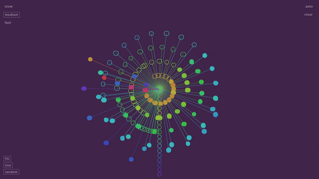

# Bloom Echo

Bloom Echo is a generative sound toy. Play with it to chill out and make blooming, undulating beats, or play it on auto + slow mode to meditate. Or do both and interact in auto mode to create music with your computer.  Time spent with Bloom Echo is reflected in a constantly shifting generative image on screen.

Made with p5.js and p5.sound.

[Play](https://zenaranya.itch.io/bloom-echo)

